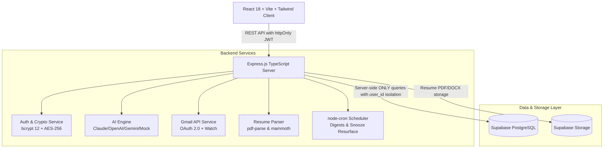
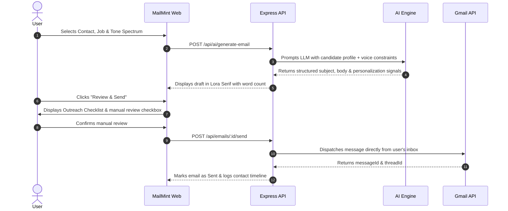

# MailMint

<div align="center">
  
  <h3>Fresh outreach. Real connections.</h3>
  <p>An AI-powered cold outreach and recruiter email management workspace for job seekers, developers, and students.</p>

  [](https://react.dev/)
  [](https://www.typescriptlang.org/)
  [](https://expressjs.com/)
  [](https://supabase.com/)
  [](https://tailwindcss.com/)
  [](LICENSE)
</div>

---

## 📖 Overview

**MailMint** is a production-grade SaaS platform built to solve the broken developer and student cold outreach problem. Instead of mass-spamming generic LinkedIn templates, MailMint uses AI to craft high-conviction, personalized recruiter emails grounded in your verified technical projects, university background, and target job descriptions.

> [!IMPORTANT]
> **MailMint is NOT a spam tool.** Every email must pass an anti-spam pre-flight checklist and be explicitly reviewed and confirmed by you before delivery. Every message is sent directly through your authenticated Google/Gmail inbox.

---

## 🏛 System Architecture



---

## ✨ Key Features

| Feature | Icon | Description |
|---|:---:|---|
| **MailMint Clipper** | 🧩 | Manifest V3 Chrome Extension: 1-click capture of recruiter profiles from LinkedIn straight to pipeline & AI generator. |
| **Reply Sentiment Sync** | 🎯 | AI classifies recruiter replies (Interview Invitation, Referral Confirmed, Rejection) & auto-updates Kanban. |
| **3-Way Theme Engine** | 🌗 | Seamless Light Mode, Dark Forge, and OS System sync with token-based semantic design. |
| **Tone Spectrum** | 🎚️ | 5 nuanced formality levels: Casual, Warm, Balanced, Professional, Formal. |
| **Paper Canvas Preview** | ✍️ | Renders generated drafts in 15px Lora serif on an authentic paper-surface canvas with envelope headers. |
| **Outreach Checklist** | 🛡️ | Pre-flight anti-spam modal verifying headline, recipient, substantive word count, and manual approval. |
| **Native Gmail Send** | 📬 | Sends directly from your inbox using AES-256 encrypted Google OAuth 2.0 tokens. |
| **Ghostwriter Mode** | 🎙️ | Analyzes 3–5 sample user emails to extract and mirror your natural writing style. |
| **Resume Versioning** | 📄 | Upload PDF/DOCX resumes (up to 5MB) with side-by-side raw text and AI-structured preview. |
| **Auto-Summarize JD** | 🧠 | Intelligently extracts core technical requirements and seniority for descriptions >500 chars. |
| **Company Research** | 🏢 | Instant AI intelligence cards providing estimated size, funding stage, news, and tech hints. |
| **A/B Split Testing** | 🔀 | 50/50 contact split test between two templates with statistical winner detection. |
| **Template Marketplace** | 🌐 | Public community marketplace with anonymous author aliases, usage counts, and live data preview. |
| **Interactive Pipeline** | 📊 | Contacts table & Kanban views, snooze resurfacer, and 6-stage job application Kanban board. |
| **Visual Analytics** | 📈 | Area charts, 8-week reply rate trends, skills gap heatmaps, and 7-day sparklines. |

---

## 🔄 AI Generation Workflow



---

## 🗄 Database Schema Overview

The database uses Supabase PostgreSQL with 14 relational tables enforcing strict `user_id` data isolation:

- **`users`**: Email/password authentication, AES-256 encrypted Gmail tokens, plan tier.
- **`profiles`**: Candidate credentials, degree, skills, experience, voice profile, email signature.
- **`resume_versions`**: Versioned PDF/DOCX resumes with parsed JSON data and default version flag.
- **`contacts`**: Recruiter network with status pipeline, snooze expiration dates, and timezone.
- **`contact_timeline`**: Audit trail of touches (drafted, sent, replied, snoozed, notes).
- **`companies`**: Target organizations with AI intelligence cards and recent news items.
- **`jobs`**: Target postings with analyzed skill summaries and LinkedIn source tracking.
- **`applications`**: 6-stage Kanban tracking (`applied`, `phone-screen`, `interview`, `offer`, `rejected`, `withdrawn`).
- **`emails`**: Drafted, scheduled, and sent emails with language codes and A/B test variant flags.
- **`campaigns`**: Multi-contact outreach cadences with A/B variant performance statistics.
- **`templates`**: Personal template library and anonymous public marketplace entries.
- **`follow_ups`**: Step cadences requiring human approval before delivery.
- **`integrations`**: Encrypted OAuth scopes and synchronization timestamps.
- **`notifications`**: In-app notifications and daily outreach digest summaries.

---

## 🚀 Quick Start Guide

### Prerequisites
- Node.js (v18+)
- npm

### 1. Clone & Setup
```bash
git clone https://github.com/your-username/mailmint.git
cd mailmint
```

### 2. Backend Setup
```bash
cd server
cp .env.example .env
npm install
npm run build
npm run dev
```

### 3. Frontend Setup
```bash
cd ../client
npm install
npm run build
npm run dev
```

Open [http://localhost:5173](http://localhost:5173) in your browser.

> [!TIP]
> **Out-of-the-Box Dev Mode**: MailMint includes an intelligent local fallback database and high-fidelity Mock AI engine. You can immediately register, draft emails, import CSVs, test the tone spectrum, and track applications without needing external API keys or cloud credentials.

---

## 🔒 Security & Privacy Rules

- **bcrypt (12 rounds)**: Industry-standard password hashing.
- **httpOnly Cookies**: Access tokens (15m) and refresh tokens (7d) are inaccessible to JavaScript XSS attacks.
- **AES-256-CBC**: All Google OAuth refresh and access tokens are encrypted before database insertion.
- **Zero Frontend Supabase**: Supabase client is never imported or bundled on the frontend.
- **Strict Anti-Spam**: No automated bulk sends without explicit per-message user approval.

---

---

## 🧩 MailMint Clipper (Chrome Extension)

MailMint comes with an unpacked Manifest V3 Chrome Extension located in `/extension`.

### How to Install:
1. Open Google Chrome and navigate to `chrome://extensions/`.
2. Toggle **Developer mode** in the top right corner to **ON**.
3. Click **Load unpacked** and select the `extension/` directory.
4. Pin the **MailMint Clipper** icon to your toolbar.
5. Browse any recruiter profile on LinkedIn and click the extension icon to parse profile data and save to your pipeline or draft an AI email with one click!

---

## 👨‍💻 Creator & Contact

- **Author**: SHIVANSH RAI
- **Portfolio**: [Shivansh Rai | Aspiring Software Developer](https://portfolio-shivansh-green.vercel.app/)
- **Email**: [shivanshrai282@gmail.com](mailto:shivanshrai282@gmail.com)

---

## 📄 License

MIT License © 2026 MailMint. Built with passion by Shivansh Rai.


